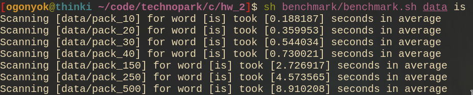
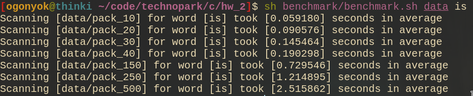
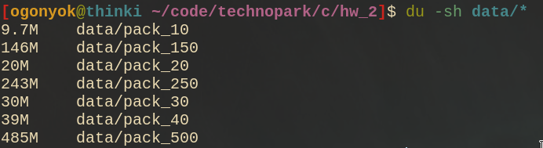

# Индивидуальное задание №2
**Выполнил: Оганес Мирзоян**

## Постановка задачи 
**Вариант #32**

В вашем распоряжении директория с 500 текстовыми файлами, каждый из которых занимает 1 МБ места на диске. Необходимо реализовать последовательную и параллельную программу поиска с использованием нескольких процессов топ-5 файлов по текстовому запросу. Принцип ранжирования – наибольшее количество упоминаний слов запроса в тексте.

## Запуск
### Подготовка
- Директория с текстовыми файлами. Мною был взят дамп википедии (`enwiki-20211020-pages-articles-multistream-index.txt.bz2.torrent` c https://www.litika.com/torrents/) размером `1GB`, который впоследствии был разбит на 10, 20, 30, 40, 150, 250, и 500 текстовых файлов (размер каждого файла примерно `1MB`)

### Последовательный поиск
- `make`
- `./build/scanner [PATH_TO_DIRECTORY_WITH_FILES] [WORD_TO_SEARCH_FOR]`

### Параллельный поиск
- `make parallel`
- `./build/scanner [PATH_TO_DIRECTORY_WITH_FILES] [WORD_TO_SEARCH_FOR]`

### Бенчмарк
- `make benchmark` или `make benchmark-parallel` для последовательного и параллельного поиска соответственно
- `sh scripts/benchmark.sh [PATH_TO_DIRECTORY_WITH_DIRECTORIES_WITH_FILES] [WORD_TO_SEARCH_FOR]`

## Результаты бенчмарка
### Последовательный поиск

### Параллельный поиск

### Размеры файлов

